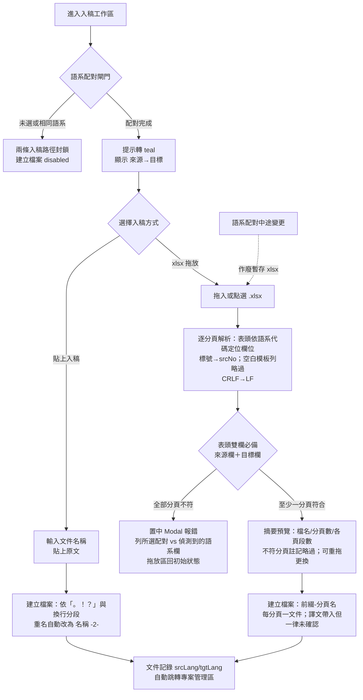
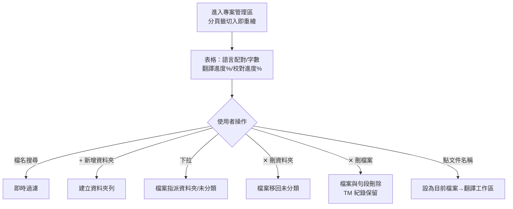
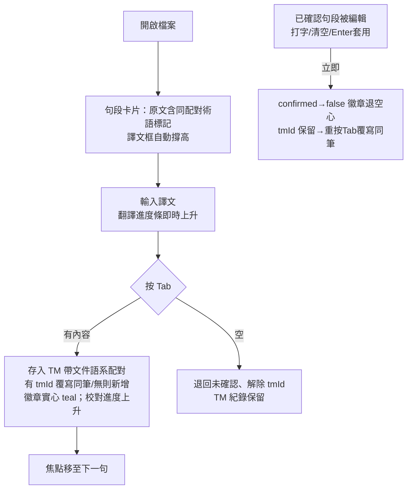
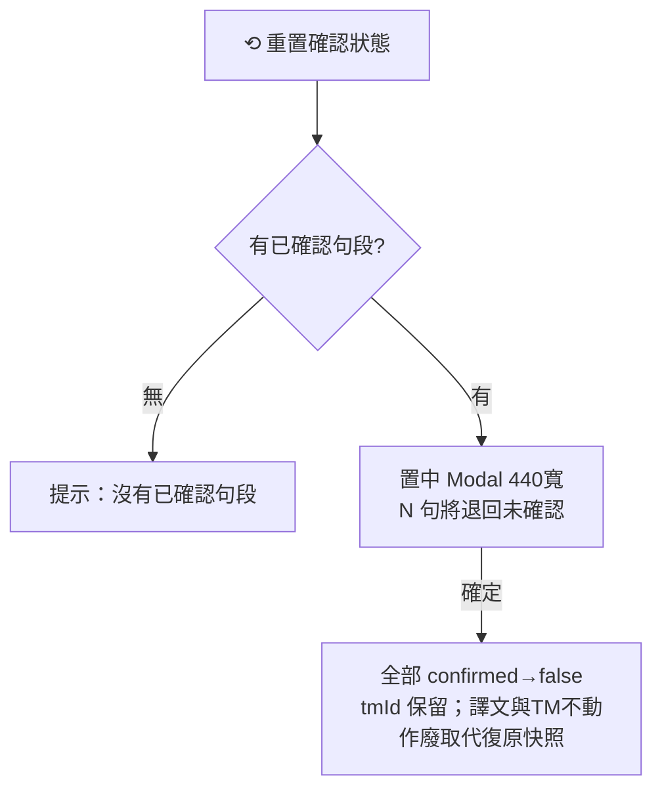
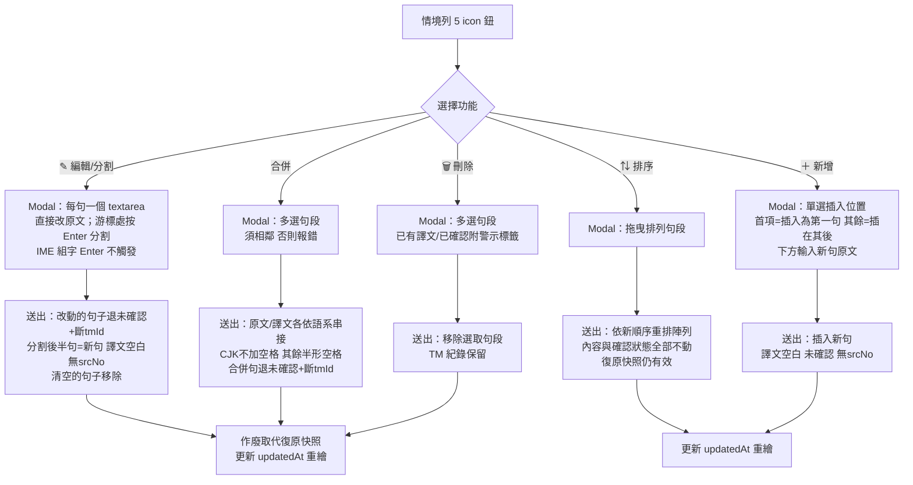
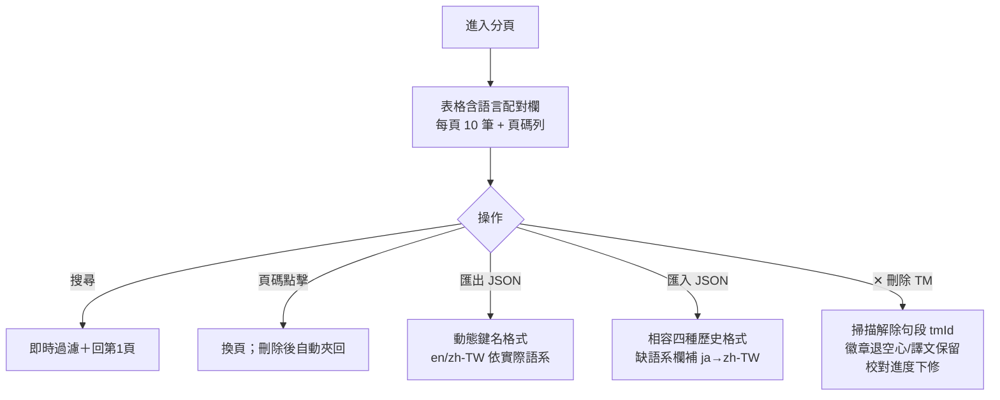
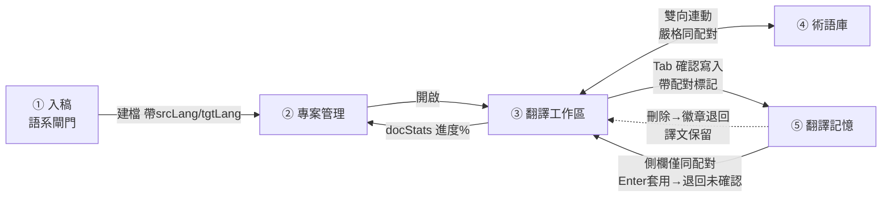

# 校譯台（cat-tool-demo）第 36 版 五大區塊流程圖

> 流程圖使用 Mermaid 語法，可在支援 Mermaid 的檢視器（GitHub、Notion、VS Code 等）直接渲染；每張圖附文字說明。

---

## ① 入稿工作區



**說明**：語系配對是唯一入口閘門。xlsx 為兩段式（解析→預覽→建檔），解析失敗不留垃圾。表頭雙欄必備：來源與目標語系欄缺一即擋該分頁，全部分頁不符時彈置中 Modal 報錯（防止選錯配對無聲匯入）。匯入的譯文照填但徽章空心——進 TM 的唯一入口仍是 Tab。

---

## ② 專案管理區



**說明**：翻譯進度% = 有譯文的句段比例（含草稿）；校對進度% = Tab 確認比例。兩值與工作區進度條同源（docStats）。

---

## ③ 翻譯工作區

### 主流程（含 V28 核心規則）



### 重置確認狀態



### 句段整理五功能（V36，情境列 icon → Modal）



**說明**：五功能皆為 Modal 式（720px 加寬、可捲動清單、取消/送出），仿 Termsoup。凡改到原文（編輯/分割/合併）一律退回未確認並解除 tmId——這是 V28「編輯即退回未確認」規則在原文側的延伸；TM 紀錄一律保留（單向資料流不變）。排序與新增是不動既有句段狀態的操作（復原快照不作廢）。

### 搜尋取代（不變）+ 側欄

```mermaid
flowchart TD
    subgraph 右側欄翻譯記憶（嚴格同配對）
    A[相似模式：聚焦句段<br>bigram Jaccard 前8筆] 
    B[搜尋模式：關鍵字]
    A & B -->|只列 samePair 紀錄| C[卡片譯文欄]
    C -->|Tab| D[更新該筆記憶]
    C -->|Enter| E[套用至左側句段<br>該句退回未確認]
    end
    subgraph 左側欄頁面檢視
    F[上下頁：前/後一檔整篇唯讀]
    G[跨頁檢視：檔名/語系代碼/內文<br>三路搜尋，最多列3檔]
    end
```

---

## ④ 術語庫 / ⑤ 翻譯記憶（共同模式）



**說明**：管理頁顯示全部配對的紀錄（跨池管理用）；工作區的比對嚴格限同配對。

---

## 跨區塊資料關係總覽


